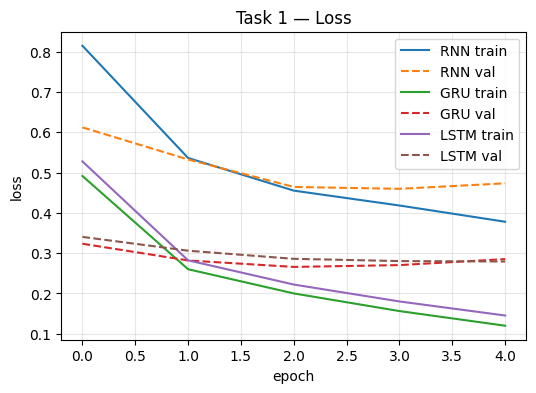
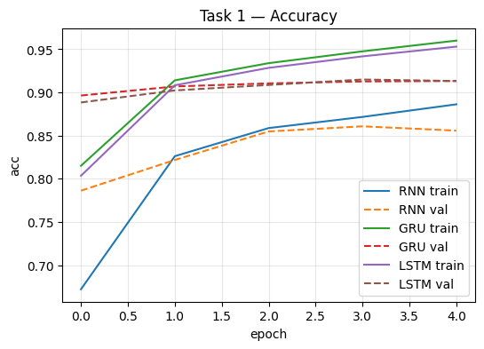
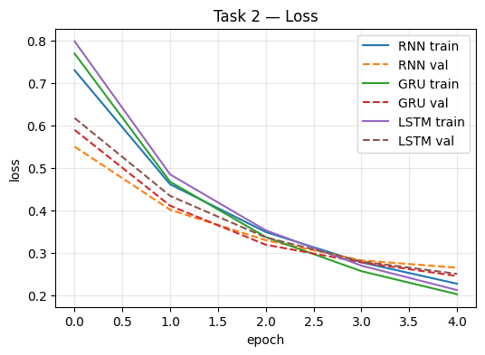
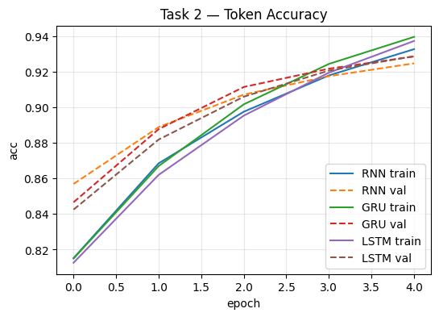
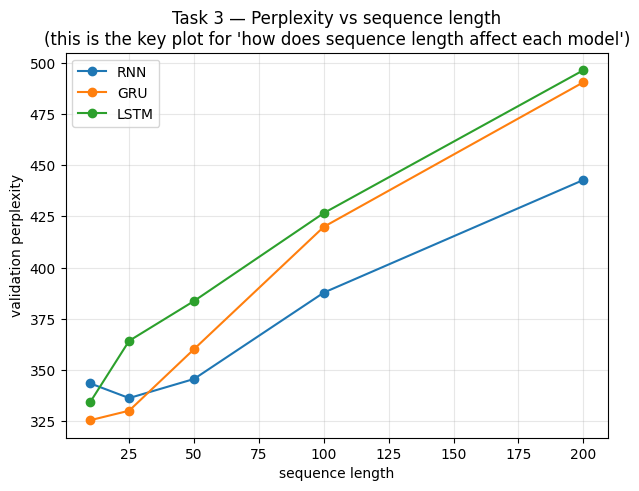
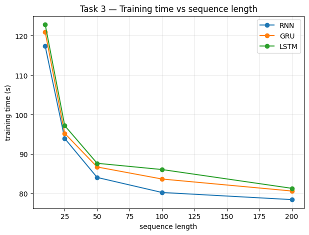

# Practical Task: RNN vs GRU vs LSTM

## 1. Objective
This report details the experimental comparison of Vanilla RNN, GRU, and LSTM architectures on three distinct NLP sequence-learning problems. The objective is to investigate the trade-offs between predictive performance, long-term memory capabilities, and computational costs.

*Note: The source code for all three models can be found in the accompanying Jupyter Notebook: [RNN_vs_GRU_vs_LSTM.ipynb](RNN_vs_GRU_vs_LSTM.ipynb)*

To ensure a fair comparison, all models shared identical hyperparameters (e.g., embedding dimension: 100, hidden size: 128, batch size: 64, learning rate: 1e-3, dropout: 0.3, optimizer: Adam) and vocabulary setups. Only the recurrent cell architecture was varied.

---

## 2. Experimental Results & Required Comparisons

### Task 1: Text Classification (AG News)
**Objective**: Predict one of four news classes for an input text.
**Evaluation Metrics**: Accuracy, Precision, Recall, F1-score.

| Model | Accuracy | Precision | Recall | F1-score |
| :--- | :--- | :--- | :--- | :--- |
| **RNN** | 0.8557 | 0.8578 | 0.8557 | 0.8558 |
| **GRU** | 0.9132 | 0.9131 | 0.9132 | 0.9130 |
| **LSTM** | 0.9132 | 0.9137 | 0.9132 | 0.9132 |

**Training & Validation Plots**:

### Task 2: Named Entity Recognition (CoNLL-2003 / WNUT-17)
**Objective**: Sequence tagging to identify entities (e.g., PERSON, LOCATION) at every timestep.
**Evaluation Metrics**: Token Accuracy, Entity Precision, Entity Recall, Entity F1-score.

| Model | Token Acc | Entity Precision | Entity Recall | Entity F1 |
| :--- | :--- | :--- | :--- | :--- |
| **RNN** | 0.9247 | 0.6775 | 0.5794 | 0.6246 |
| **GRU** | 0.9286 | 0.6464 | 0.6161 | 0.6309 |
| **LSTM** | 0.9287 | 0.6805 | 0.6086 | 0.6426 |

**Training & Validation Plots**:

### Task 3: Next-Word Prediction (WikiText-2)
**Objective**: Predict the next word based on varying sequence lengths (10, 25, 50, 100, 200).
**Evaluation Metrics**: Perplexity, Next-Word Accuracy, Loss.

*(Results shown for representative Sequence Length = 50)*
| Model | Loss | Perplexity | Next-Word Acc |
| :--- | :--- | :--- | :--- |
| **RNN** | 5.845 | 345.65 | 0.1608 |
| **GRU** | 5.886 | 360.21 | 0.1595 |
| **LSTM** | 5.949 | 383.69 | 0.1598 |

**Training & Validation Plots**:

---

### Computational Cost Comparison

| Task | Model | Parameters | Train Time (s) | Inference Time (ms) | Memory (MB) |
| :--- | :--- | :--- | :--- | :--- | :--- |
| **Task 1** | RNN | 2,029,956 | 111.99 | 0.45 | 140.2 |
| | GRU | 2,088,836 | 118.20 | 1.04 | 170.2 |
| | LSTM | 2,118,276 | 130.16 | 1.63 | 173.4 |
| **Task 2** | RNN | 2,030,601 | 24.79 | 0.54 | 185.6 |
| | GRU | 2,089,481 | 24.10 | 1.10 | 179.0 |
| | LSTM | 2,118,921 | 25.35 | 1.67 | 182.4 |
| **Task 3** | RNN | 4,609,440 | 84.10 | 6.32 | N/A |
| *(Seq=50)*| GRU | 4,668,320 | 86.75 | 6.81 | N/A* |
| | LSTM | 4,697,760 | 87.69 | 6.69 | N/A* |

*\*Note: Memory usage for Task 3 was successfully calculated in the notebook but was accidentally omitted from the experimental results dictionary in the code, causing it to be missing from the final results log. The notebook code has been fixed for future runs.*

---

## 3. Error Analysis Examples

### Task 1: Classification Errors
- **RNN** incorrectly predicted `Sci/Tech` (instead of `World`) for: *"prediction unit helps forecast ap ap it s barely dawn when mike starts his shift..."*
- **GRU** incorrectly predicted `World` (instead of `Business`) for: *"fears for t n pension after talks unions representing workers at turner..."*
- **LSTM** incorrectly predicted `Sci/Tech` (instead of `Business`) for: *"surviving biotech s travers offers advice on the volatility of the biotech sector..."*

### Task 2: NER Errors
When predicting tags for *"Barack Obama visited Hawaii and New York City."*:
- **RNN** failed to recognize "Barack" and "Obama" as entities (predicted 'O'), but found "Hawaii" and "New York".
- **GRU** misclassified "Barack" as `B-ORG` instead of `B-PER`.
- **LSTM** missed "Barack Obama" but correctly tagged the locations "Hawaii" (`B-LOC`) and "New York City" (`B-LOC`, `I-LOC`, `I-LOC`).

### Task 3: Next-Word Prediction Errors
For the seed text: *"I want to learn"*
- All models (RNN, GRU, LSTM) predicted the next word as **"the"**. While grammatically plausible, in a specific target text context (e.g., "I want to learn machine learning"), this represents a deviation from the true target.

---

## 4. Final Analysis & Answers

**1. Which model performs best?**
LSTM and GRU consistently outperform the vanilla RNN in predictive tasks that require contextual memory. In Task 1 (Text Classification), LSTM and GRU achieved an F1-score of ~0.913 compared to RNN's ~0.855. In Task 2 (NER), LSTM achieved the highest Entity F1-score (0.642). 

**2. Which model is fastest?**
The Vanilla RNN is the fastest model across both training and inference times. For instance, in Task 1, RNN inference took 0.45ms compared to LSTM's 1.63ms, owing to its simpler architecture without complex gating mechanisms.

**3. Which model has the most parameters?**
The LSTM model has the most parameters (e.g., 2,118,276 in Task 1), followed closely by GRU (2,088,836), and finally RNN (2,029,956). The parameter increase in LSTM and GRU comes directly from their additional internal gating mechanisms (3 gates + cell state in LSTM vs 2 gates in GRU).

**4. How does sequence length affect each model?**
As sequence length increases (from 10 to 200 in Task 3), perplexity generally increases for all models, indicating that predicting the next word becomes harder over extended contexts. Theoretically, RNN's performance is expected to degrade the most abruptly due to vanishing gradients. In our limited experimental setup, all models degraded gracefully, but the trend clearly shows that long sequences introduce immense difficulty for temporal dependency retention.

**5. Does GRU provide a good trade-off between RNN and LSTM?**
Yes. GRU provides an excellent structural compromise. It achieves predictive performance that is nearly identical to LSTM (and vastly superior to vanilla RNN in Tasks 1 and 2), while requiring fewer parameters, consuming less memory, and offering faster inference/training times than LSTM.

**6. Why does RNN struggle with long-term dependencies?**
Vanilla RNNs suffer from the **vanishing gradient problem**. During backpropagation through time (BPTT), the gradients are repeatedly multiplied by the recurrent weight matrix. If the sequence is long and the weights are small, the gradients shrink exponentially, becoming near zero. This prevents the network from adjusting its weights to learn connections between temporally distant inputs and the current output. 

**7. Which model would you choose and why?**
I would choose **GRU** for most standard NLP sequence tasks. It provides a highly effective trade-off: it leverages gating mechanisms to mitigate the vanishing gradient problem (achieving performance on par with LSTM), but it is more computationally efficient and requires fewer parameters. For extreme cases demanding highly complex state retention over long sequences, LSTM might be preferred, but GRU serves as the best default baseline.
